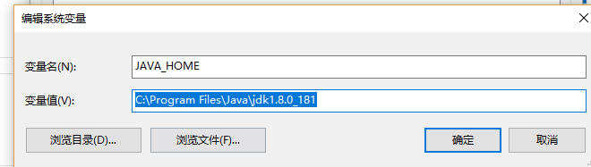
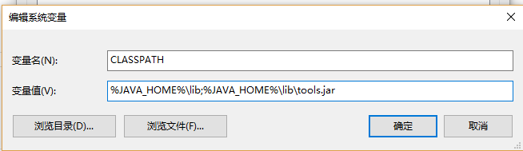
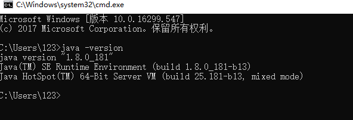

## 1.1.1 安装 Jdk1.8
打开 [Jdk 官网](http://www.oracle.com/technetwork/java/javase/downloads/jdk8-downloads-2133151.html) 下载，
点击安装 下一步，下一步，下一步… 就对了！！

## 1.1.2 环境变量设置
进入配置环境变量的界面：右击我的电脑–>属性–>高级环境设置–>环境变量

**1. JAVA_HOME**
系统变量下，新建一个系统变量JAVA_HOME,属性值：C:\Program Files\Java\jdk1.8.0_181

**2. Path**
在系统变量上找到path ,直接在属性值上最后头添加 ;%JAVA_HOME%\bin 

**3. CLASSPATH** 
如果没有就新建一个，有的话，直接在属性值上最前头添加 .;%JAVA_HOME%\lib;%JAVA_HOME%\lib\tools.jar ，注意：前边有一个黑点加分号，classpath是为了java加载类(class or lib)路径。

## 1.1.3验证
CMD输入：java -version 
