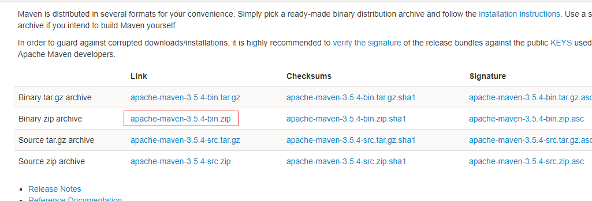
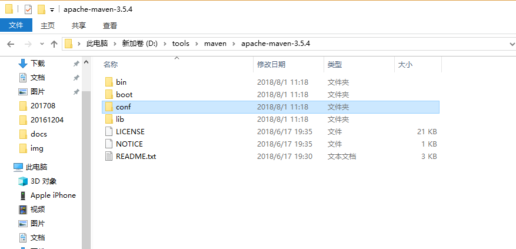
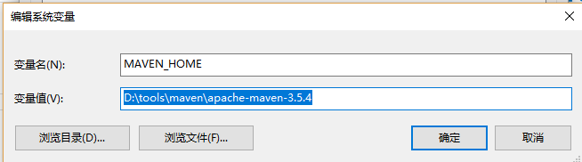
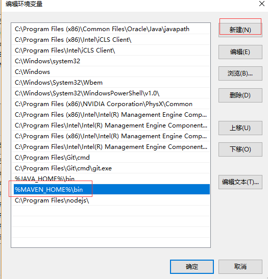
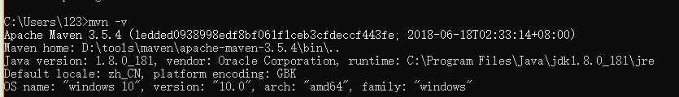
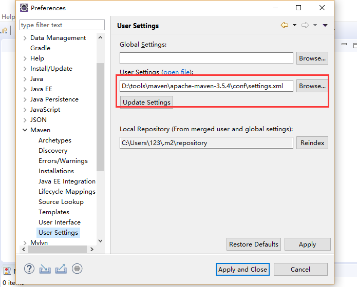

## 1.3.1 下载与安装

**第一步**

前往[Maven 官网](https://maven.apache.org/download.cgi) 最新版的Maven程序：



**第二步**

将文件解压到D:\tools\maven\apache-maven-3.5.4目录下（根据自己实际情况来，没有特别要求）


**第三步**

新建环境变量MAVEN_HOME，赋值D:\tools\maven\apache-maven-3.5.4


**第四步**

编辑环境变量Path，追加%MAVEN_HOME%\bin\;



**第五步**
至此，maven已经完成了安装，我们可以通过DOS命令检查一下我们是否安装成功：
```
mvn -v
```



## 1.3.2 maven阿里云中央仓库
修改maven根目录下的conf文件夹中的setting.xml文件，内容如下：
```
<settings xmlns="http://maven.apache.org/SETTINGS/1.0.0"
    xmlns:xsi="http://www.w3.org/2001/XMLSchema-instance"
    xsi:schemaLocation="http://maven.apache.org/SETTINGS/1.0.0
                              https://maven.apache.org/xsd/settings-1.0.0.xsd">
    <localRepository />
    <interactiveMode />
    <usePluginRegistry />
    <offline />
    <pluginGroups />
    <servers />
    <mirrors>
        <mirror>
        <id>nexus-aliyun</id>
        <mirrorOf>*</mirrorOf>
        <name>Nexus aliyun</name>
        <url>http://maven.aliyun.com/nexus/content/groups/public</url>
    </mirror>
    </mirrors> 
    <proxies />
    <profiles />
    <activeProfiles />
</settings>
```

## 1.3.3 eclipse配置maven
打开Window->Preferences->Maven->User Settings，指定setting路径配置后 点Apply
