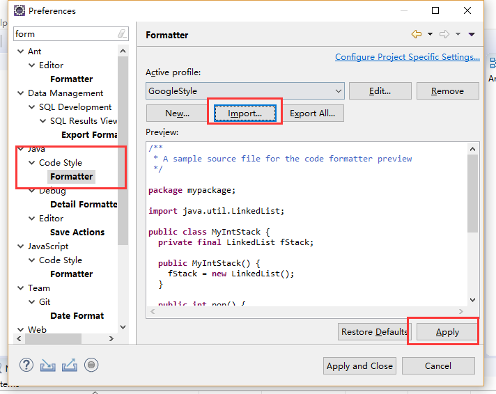

## 1.5.1 Eclipse中使用google代码风格

**第一步**

下载eclipse-java-google-style.xml文件， 第一种方式 在https://github.com/google/styleguide中通过git clone获取eclipse-java-google-style.xml（也可以用下面地址下载：https://pan.baidu.com/s/17AFMdmbOc7HlFJqaUAPNNQ）

**第二步**

导入方法：Eclipse->window->preferences->Java->Code Style->Formatter->Import 选择eclipse-java-google-style.xml文件。

