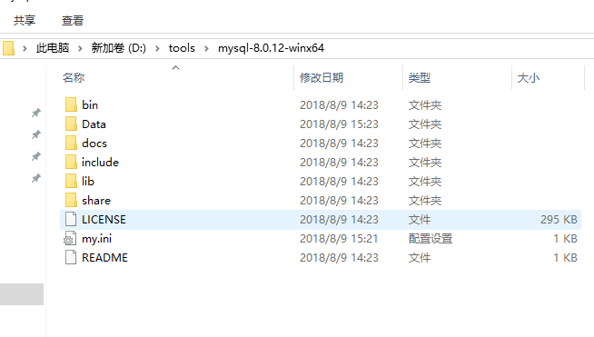
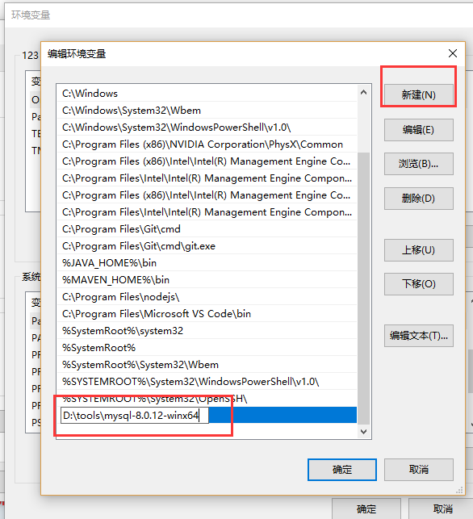
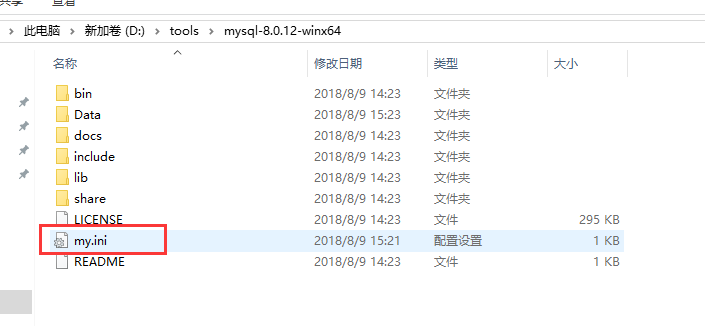
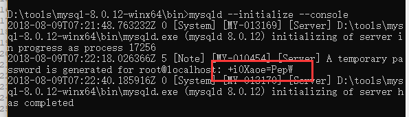
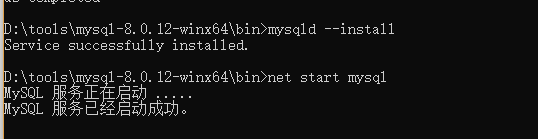
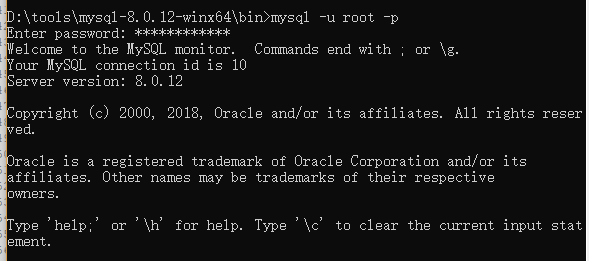

# 1.6 MySQL-8.0.12安装配置

## 1.6.1下载zip安装包
MySQL8.0 For Windows zip包下载地址：https://dev.mysql.com/downloads/file/?id=479669 ，进入页面后可以不登录。后点击底部“No thanks, just start my download.”即可开始下载。

## 1.6.2安装  
**2.1 解压zip包到安装目录**  
我的解压在了D:\tools\mysql-8.0.12-winx64  
  

**2.2 配置环境变量**  
找到系统属性，进入环境变量设置  选择系统变量中的path进行编辑，新建一个路径，这个路径就是你的MYSQL解压路径  
  

**2.3 配置初始化的my.ini文件**  
 发现解压后的目录并没有my.ini文件，没关系可以自行创建。在安装根目录下添加 my.ini（新建文本文件，将文件类型改为.ini），写入基本配置：  
```[mysqld]
# 设置3306端口
port=3306
# 设置mysql的安装目录
basedir=D:\\tools\\mysql-8.0.12-winx64   # 切记此处一定要用双斜杠\\，单斜杠我这里会出错，不过看别人的教程，有的是单斜杠。自己尝试吧
# 设置mysql数据库的数据的存放目录
datadir=D:\\tools\\mysql-8.0.12-winx64\\Data		# 此处同上
# 允许最大连接数
max_connections=200
# 允许连接失败的次数。这是为了防止有人从该主机试图攻击数据库系统
max_connect_errors=10
# 服务端使用的字符集默认为UTF8
character-set-server=utf8mb4
# 创建新表时将使用的默认存储引擎
default-storage-engine=INNODB
# 默认使用“mysql_native_password”插件认证
default_authentication_plugin=mysql_native_password
[mysql]
# 设置mysql客户端默认字符集
default-character-set=utf8mb4
[client]
# 设置mysql客户端连接服务端时默认使用的端口
port=3306
default-character-set=utf8mb4
```
  

## 1.6.3、安装mysql  
在安装时，必须以管理员身份运行cmd，否则在安装时会报错，会导致安装失败的情况  
**3.1 初始化数据库**  
在MySQL安装目录的 bin 目录下执行命令： 
```
mysqld --initialize --console
```
执行完成后，会打印 root 用户的初始默认密码，比如：
  
注意！执行输出结果里面有一段：[Server] A temporary password is generated for root@localhost: +i0Xaoe=PepW 其中root@localhost:后面的“+i0Xaoe=PepW”就是初始密码（不含首位空格）。在没有更改密码前，需要记住这个密码，后续登录需要用到。

**3.2 安装服务**

在MySQL安装目录的 bin 目录下执行命令：

mysqld --install [服务名]

后面的服务名可以不写，默认的名字为 mysql。当然，如果你的电脑上需要安装多个MySQL服务，就可以用不同的名字区分了，比如 mysql5 和 mysql8。

安装完成之后，就可以通过命令net start mysql启动MySQL的服务了。通过命令net stop mysql停止服务。通过命令sc delete MySQL/mysqld -remove卸载 MySQL 服务  
  

## 1.6.4、更改密码

在MySQL安装目录的 bin 目录下执行命令：
```
mysql -u root -p
```
这时候会提示输入密码，记住了上面第3.1步安装时的密码，填入即可登录成功，进入MySQL命令模式。
  
在MySQL中执行命令：
```
ALTER USER 'root'@'localhost' IDENTIFIED WITH mysql_native_password BY '新密码';  
```
修改密码，注意命令尾的；一定要有，这是mysql的语法
到此，安装部署就完成了。官方说测试速度MySQL8比5快两倍。