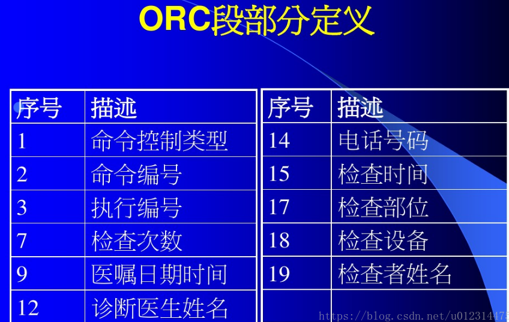
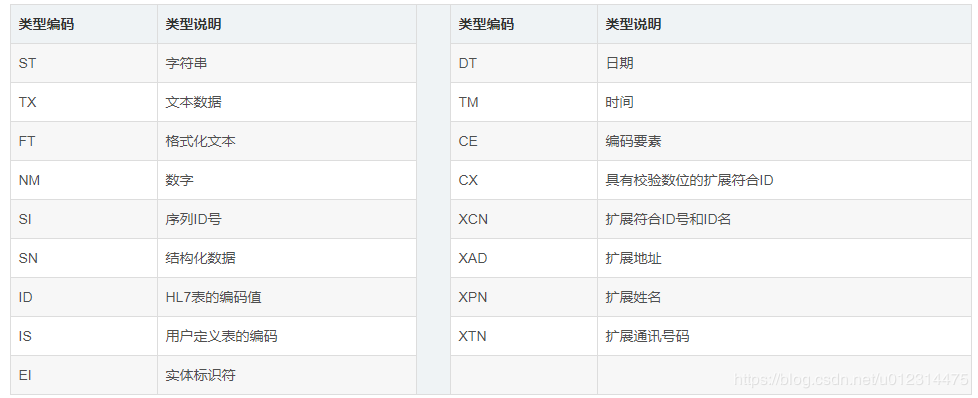
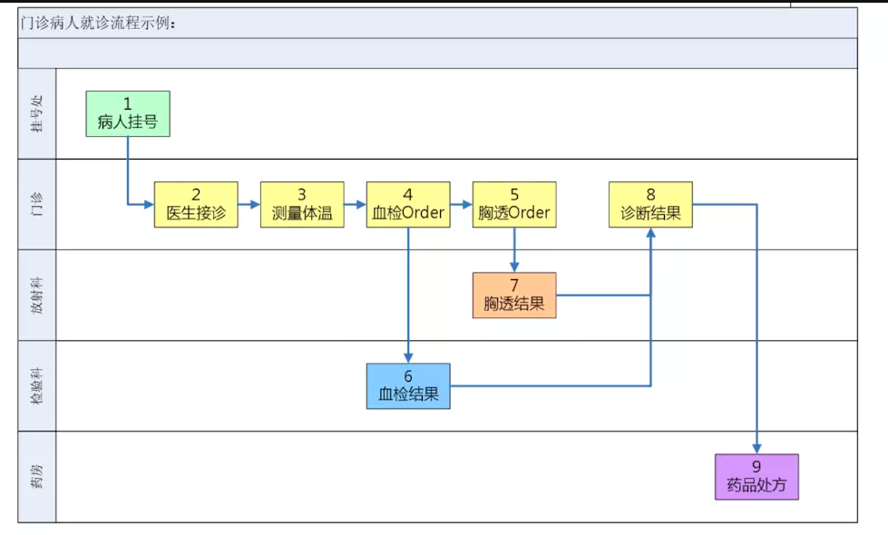

## HL7背景
HL7 Health Level Seven组织成立於1987年，由SamSchultz博士在宾夕法尼亚州大学医院主持的一次会议促成了HL7组织和通信标准的诞生。HL7在美国的电子病历系统中应用非常广泛, 实验室数据, 预约注册信息, 住院床位转换, 医生信息更新等等都在广泛应用HL7标准在不同的系统间进行数据转换.   
HL7的主要应用领域是HIS/RIS/PACS，主要是规范HIS/RIS/PACS系统及其设备之间的通信，它涉及到病房和病人信息管理、化验系统、药房系统、放射系统、收费系统等各个方面。HL7的宗旨是开发和研制医院数据信息传输协议和标准，规范临床医学和管理信息格式，降低医院信息系统互连的成本，提高医院信息系统之间数据信息共享的程度。  
国际上，计算机数据交互的最普遍的格式是XML，医院信息系统的数据交互主要是遵循DICOM(医学数字成像和通信)和HL7这两个标准。利用DICOM和HL7标准，在必要时使用XML格式作为补充.  
HL7目前有V2, V3, FHIR等, 目前应用的最多的还是HL7 V2. HL7 V3在实际应用中并不是很普遍(欧洲有一部分国家在用). FHIR是这两年开始兴起的"轻量级"HL7数据交换标准, 但目前还没有进入广泛应用阶段(即便是在美国).  
国内目前在大医院里应用的主要是HL7 V2, 用于实验室数据交互的较多

## HL7 v2.x

我们通常称其为HL7 v2.x，为纯文本格式。下面我们通过实例讲解一下：
```
MSH|^~\&|ADT1|MCM|LABADT|MCM|198808181126|SECURITY|ADT^A01|MSG00001-|P|2.3
EVN|A01|198808181123
PID|||PATID1234^5^M11||JONES^WILLIAM^A^III||19610615|M-||C|1200 N ELM STREET^^GREENSBORO^NC^27401-1020|GL|(91-9)379-1212|(919)271-3434||S||PATID12345001^2^M10|123456789|9-87654^NC
NK1|1|JONES^BARBARA^K|WIFE||||||NK
PV1|1|I|2000^2012^01||||004777^LEBAUER^SIDNEY^J.|||SUR||-||ADM|A0-
OBX|1|NM|^Body Height||1.80|m^Meter^ISO+|||||F
OBX|2|NM|^Body Weight||79|kg^Kilogram^ISO+|||||F
AL1|1||^Penicillin||Produces hives
AL1|2||^Cat dander|Respiratory distress
```
HL7 v2.x 是一种基于传输数据的事物，按照特定的编码规则而制定的字符。说白了就是一段字符串，而且这个字符串，不同的区域代表这不同的数据区（及不同的传输事物，例如：MSH：消息头，ADT_A05：事件类型，PID：病人信息）
首先，每一行代表一个信息段，每一段内使用竖线（|）作为字段分隔符来划分信息段（Field）。每一段都是由三个字母起始，用于表明该信息段的内容。上面这个HL7文件共九行七类
文件头（MSH）  
事件信息（EVN）  
患者信息（PID）  
直系亲属信息（NK1）  
诊疗时间（PV1）  
查体信息（OBX）  
过敏信息（AL1）  
其中的ADT指的是入院、出院和转移，通常简称为ADT(Ad-mission、Discharge、Transfer）。ADT主要是关于病人个人信息的生成和更新，以及病人来访等信息数据的交换。由于任何加入医疗系统网络的设备都需要病人的个人信息，ADT是HL7标准中应用最广泛的一个方面。通常，进入一个ADT系统的数据总是要传递给医院的各种系统  
从上可以看出，如果统一类别的信息项目超过一个的话，可以重复使用信息段。  

```
MSH|^~\&|ADT1|MCM|LABADT|MCM|198808181126|SECURITY|ADT^A01|MSG00001-|P|2.3
我们再分析一下第一行。这一段被分隔符划分成了12个信息段：
```

MSH 表示这一段为信息头，是每个HL7信息的开始部分。  
| 表示字段分隔符  
^~\& 这是个字符为设定的组件分隔符、重复分隔符、escape character（中文啥意思来着？）、子组件分隔符  
ADT1 信息发出方应用程序代码  
MCM 信息发出方机构代码  
LABADT 信息接收方应用程序代码  
MCM 信息接收方机构代码  
198808181126 为信息发出的时间，为1988年8越18日11点26分  
SECURITY 表示这个信息为保密信息  
ADT^A01 为信息内容的分类，这个信息使用了组件分隔符（^）分成了两部分，ADT表示入院、出院、转诊（Admission，Discharge，Transfer），A01表示接诊（Admit/Visit）。也就是说这个HL7信息为患者在接诊后采集的信息。  
MSG00001- 为信息标识号码  
P 为信息处理代码，P代表正式产品信息（Production）  
2.3 表示这段信息使用的HL7版本号  


### 字段含义：
Z信息段：  
    Z信息段是指与HL7第二版标准其它信息段不匹配的临床或病人信息。Z信息段用来接收与HL7标准信息定义不匹配的数据，Z信息段可以插入任何信息。  
ADT信息：  
    最常使用的HL7第二版信息类型是ADT或者允许转出传递信息。记录病人的统计和访问信息。该信息由医院信息系统(HIS)或登记申请产生，向其它相连的系统报告重要的病人信息，例如病人入院、出院、转院的时间，病人的统计数据的变化。  
ORM信息：  
    ORM信息是一种普通的订购信息、下单申请，包含临床物资的请求。包含临床物资的请求，例如500毫升盐水、心电图研究服务。  
ORU信息：  
    ORU即观察报告（非请求观察）信息，是ORM信息填写申请产生的结果信息。ORU信息常包含实验室、放射科的测试结果等医疗程序的信息和分析。RIS  
HL7分隔符字符：  
|(字段分隔符，亦称pipe)   
^(组件分隔符，亦称hat)  成分分隔符  
&(子组件分隔符) 子成分分隔符  
~(字段重复分隔符)  
{}表示该消息段可重复  
片段（消息）终止符   十六进制的0DH  
信息类型：  
ADT 表示  
HL7总共有84种信息类型：  
信息类型（Message Type），信息类型用于定义信息目的和用途  
每条信息由若干个信息段（Segment）组成，ADT（病人管理系统？）信息段表示入院（ADT^A01）、出院和转院的相关信息，回复确认消息是ACK（acknowledge：确认的意思）  
ACK：确认消息  AA接受成功，AE接受错误，AR拒绝消息  
ORM：一般医嘱消息  
ORR：一般医嘱应答消息  
QRY/QRF：原始模式显示查询消息  
DSR：显示应答消息 LIS可以用本消息立即将查询结果发送给HIS，也可先发一个QCK（查询确认信息）给HIS，确认已经收到查询请求，然后在以后的某个时间将通过DSR发送给HIS  
QCK：查询确认信息  
DFT:细节财务信息  
HL7 共有110 个信息段,  
每个信息段( Segment )由一组数据字段(Data field) 组成, 每一信息段都有相应的名称, 用于界定其内容或功能 如, MessageHeader (MSH) , Event Type ( EVN) , PatientID ( PID) , and Patient Visit ( PV1) 。  
信息段分为: 必须、可选、可重复三种类型。  
EVN：事件类型段，包含事件类型代码、日期/时间表、日期/计划事件表、事件原因代码、操作员ID  
PID：就诊者身份识别段  
PV1：就诊者就诊段  
PV2：就诊者就诊附加信息段  
NK1：近亲、社会关系段  
ORC：医嘱命令所作的检查项目  
OBR：关于诊断以及观察的请求信息，用于记录医嘱信息  

OBX：用于记录观察结果  
QRD：查询定义段 ，用来定义查询的内容  
    查询时间、编码格式、优先等级、ID号、请求数据的最大值、请求方的信息、所要请求的内容、数据编码的部门信息  
QRF:进一步定义查询内容  
DSP：重复消息段 装载LIS返回的报告结果，需要用循环的方式把数据取出  
字段( Fields) : 是一个字符串。字段须定义其位置、长度、数据类型( HL7共有53 种数据类型) 、选择类型、重复性。
表( Table) : 分为HL7 标准表和用户自定义表两种。  
其中HL7 标准表(118 个) 为HL7 规定必须使用的表; 用户自定义表( 185 个) 为HL7 推荐使用的表  
HL7数据类型：  


## HL7 v3.0
V3 校 V2.x 多了许多内容，因为 V2.x 仅支持语法交互，而V3支持语义交互  
v2.x :  给病人止痛药  
v3    :  给病人用药止痛  
从意思上来说，大家都知道，但是如果要深究起来，v3稍微更具体些。因为“给病人止痛药”有很多层意思，比如：是委托家属给病人止痛药 还是 只是给病人一个止痛药；但是在v3的就不会有这种模糊的意思，而且还带有了特殊的语境（下医嘱）。因此，v3的出现，能够更加准确地描述医疗行为/事务。  
其实v3是一把双刃剑，由于他的传输格式复杂性，在开发上还是存在许多障碍的。许多国内的PACS LIS 也不太愿意将他们原本的v2升级到v3，因为这里边的成本太高了。所以消息中间件就应运而生了。  

```
<?xml version="1.0" encoding="UTF-8"?>
<POLB_IN224200UV01 xmlns:hl7="urn:hl7-org:v3" xmlns:xsi="http://www.w3.org/2001/XMLSchema-instance" ITSVersion="XML_1.0">
    <templateId extension="VS_RM200901CO01" assigningAuthorityName="HospitalJorgeHUribe"/>
    <id extension="MSG0000001"/>
    <creationTime value="20100511220525"/>
    <interactionId root="2.16.840.1.113883.1.6" extension="POLB_IN224202UV01"/>
    <processingCode code="P"/>
    <processingModeCode code="T"/>
    <acceptAckCode code="NE"/>
    <receiver typeCode="RCV">
        <device classCode="DEV" determinerCode="INSTANCE">
            <id extension="HIS001"/>
        </device>
    </receiver>
    <sender typeCode="SND">
        <device classCode="DEV" determinerCode="INSTANCE">
            <id extension="VSM001"/>
        </device>
    </sender>
    <controlActProcess classCode="CACT" moodCode="EVN">
        <code code="POLB_TE004202UV01" codeSystem="2.16.840.1.113883.1.11.20299" codeSystemName="LaboratoryTriggerEventType" displayName="Result Complete"/>
        <languageCode code="es-co" codeSystem="2.16.840.1.113883.1.11.11526" codeSystemName="HumanLanguage" displayName="Espanol Colombia"/>
        <subject typeCode="SUBJ" contextConductionInd="false">
            <observationBattery classCode="BATTERY" moodCode="EVN">
                <id extension="VS12340000"/>
                <code code="28562-7" codeSystem="2.16.840.1.113883.6.1" codeSystemName="LOINC" displayName="Vital Signs"/>
                <statusCode code="complete"/>
                <recordTarget typeCode="RCT" contextControlCode="OP">
                    <patient classCode="PAT">
                        <id extension="6537077"/>
                        <patientPerson classCode="PSN" determinerCode="INSTANCE">
                            <name>
                                <given>ANDRES FELIPE</given>
                                <family>FERNANDEZ CORTES</family>
                            </name>
                            <administrativeGenderCode code="M" codeSystem="2.16.840.1.113883.5.1" codeSystemName="AdministrativeGender"/>
                            <birthTime value="19860705"/>
                        </patientPerson>
                    </patient>
                </recordTarget>
                <author typeCode="AUT">
                    <time value="20100511220525"/>
                    <assignedEntity classCode="ASSIGNED">
                        <assignedDevice classCode="DEV" determinerCode="INSTANCE">
                            <id extension="VSM001"/>
                            <manufacturerModelName code="VSM" codeSystem="BiomedicalDevice" displayName="Vital Signs Monitor"/>
                        </assignedDevice>
                    </assignedEntity>
                </author>
            </observationBattery>
        </subject>
    </controlActProcess>
</POLB_IN224200UV01>
```
其实v3是一把双刃剑，由于他的传输格式复杂性，在开发上还是存在许多障碍的。许多国内的PACS LIS 也不太愿意将他们原本的v2升级到v3，因为这里边的成本太高了。所以消息中间件就应运而生了。由于HL7 v3本身真正实施的场景不多，所以就不过多的介绍。从上我们可以看出HL7 v3相较v2在结构上变得更加复杂。虽然也是通过信息段来定义传输的信息，但是加入了大量的附加信息。同时在v3中，URN开始被大量的使用。另外就是随着HL7 RIM的使用，编码系统（codeSystem）这个概念被引入了进来，这也是术语标准被嵌入到传输标准中的正式开始。

## HL7 CDA
由于使用HL7 v3替代v2的努力失败，所以HL7鸟枪换炮的重新包装一下，推出了专门用于传输临床文件的CDA。因为CDA的文件比较大，这里只截取部分作为演示：  
```
<ClinicalDocument xmlns="urn:hl7-org:v3" xmlns:voc="urn:hl7-org:v3/voc" xmlns:xsi="http://www.w3.org/2001/XMLSchema-instance" templateId="2.16.840.1.113883.3.27.1776">
 <id extension="c266" root="2.16.840.1.113883.3.933"/>
 <code code="11488-4" codeSystem="2.16.840.1.113883.6.1" displayName="Consultation note"/>
 <title>Good Health Clinic Consultation Note</title>
 <effectiveTime value="20000407"/>
 <confidentialityCode code="N" codeSystem="2.16.840.1.113883.5.25"/>
 <setId extension="BB35" root="2.16.840.1.113883.3.933"/>
 <versionNumber value="2"/>
...........
 <component>
  <StructuredBody>
   <component>
    <section>
     <code code="10164-2" codeSystem="2.16.840.1.113883.6.1" codeSystemName="LOINC"/>
     <title>History of Present Illness</title>
     <text>
      Henry Levin, the 7th is a 67 year old male referred for further asthma management. Onset of asthma in his
      <content revised="delete">twenties</content>
      <content revised="insert">teens</content>
      . He was hospitalized twice last year, and already twice this year. He has not been able to be weaned off steroids for the past several months.
     </text>
    </section>
   </component>
   <component>
    <section>
     <code code="11502-2" codeSystem="2.16.840.1.113883.6.1" codeSystemName="LOINC"/>
     <title>Labs</title>
     <text>
      <list>
       <item>CXR 02/03/1999: Hyperinflated. Normal cardiac silhouette, clear lungs.</item>
       <item>Peak Flow today: 260 l/m</item>
      </list>
     </text>
     <entry>
      <Observation>
       <id root="10.23.4573.15877"/>
       <code code="282290005" codeSystem="2.16.840.1.113883.6.96" codeSystemName="SNOMED CT" displayName="Imaging interpretation"/>
       <value xsi:type="CD" code="249674001" codeSystem="2.16.840.1.113883.6.96" codeSystemName="SNOMED CT" displayName="Chest hyperinflated"/>
       <reference typeCode="SPRT">
        <ExternalObservation classCode="DGIMG">
         <id root="123.456.2557"/>
         <code code="56350004" codeSystem="2.16.840.1.113883.6.96" codeSystemName="SNOMED CT" displayName="Chest-X-ray"/>
        </ExternalObservation>
       </reference>
      </Observation>
     </entry>
    </section>
   </component>
  </StructuredBody>
 </component>
</ClinicalDocument>
```
从这个例子中我们可以看出，CDA完全继承了HL7 v3的结构特性，但是在其内容上主要包括了text段的纯文字信息以及附带了被编码细化的信息。HL7 CDA内容可以涵盖从患者病史、查体、用药到实验室检查、病理报告等所有可以记录在纸质病志上的信息。因为其适用范围广，所以被作为区域健康信息交换的标准大量使用在HIE中。  
```
CDA
https://github.com/brynlewis/C-CDA_Viewer/tree/master/samples
http://brynlewis.org/challenge/index.htm
```

## HL7 FHIR
随着健康数据精准分析和交互性需求的不断增加，用户对于基于文本内容的信息交换不再满足。2014年，HL7正式开始了FHIR的开发道路。今年年初，FHIR第三版，也就是正式意义的成品版本发布。有别于之前的HL7自定义传输格式，FHIR制定的是数据格式和应用接口。  

由于FHIR定义的是数据格式，所以其具体的文件格式可以多种多样，XML、JSON、Turtle等都是官方支持的。FHIR采用基于面向对象数据模式，更加符合现在的编程理念。由于FHIR定义了基于Web API的标准应用接口，提供查询、添加、修改、删除等功能。由此，用户可以更加便捷进行产品开发，尤其是更加有利于基于Web用户界面的客户端实施。  
下面是一个JSON格式的患者信息FHIR文档示例：  
```
{
  "resourceType": "Patient",
  "id": "example",
  "text": {
    "status": "generated",
    "div": "<div xmlns=\"http://www.w3.org/1999/xhtml\">\n\t\t\t<table>\n\t\t\t\t<tbody>\n\t\t\t\t\t<tr>\n\t\t\t\t\t\t<td>Name</td>\n\t\t\t\t\t\t<td>Peter James \n              <b>Chalmers</b> (&quot;Jim&quot;)\n            </td>\n\t\t\t\t\t</tr>\n\t\t\t\t\t<tr>\n\t\t\t\t\t\t<td>Address</td>\n\t\t\t\t\t\t<td>534 Erewhon, Pleasantville, Vic, 3999</td>\n\t\t\t\t\t</tr>\n\t\t\t\t\t<tr>\n\t\t\t\t\t\t<td>Contacts</td>\n\t\t\t\t\t\t<td>Home: unknown. Work: (03) 5555 6473</td>\n\t\t\t\t\t</tr>\n\t\t\t\t\t<tr>\n\t\t\t\t\t\t<td>Id</td>\n\t\t\t\t\t\t<td>MRN: 12345 (Acme Healthcare)</td>\n\t\t\t\t\t</tr>\n\t\t\t\t</tbody>\n\t\t\t</table>\n\t\t</div>"
  },
  "identifier": [
    {
      "use": "usual",
      "type": {
        "coding": [
          {
            "system": "http://hl7.org/fhir/v2/0203",
            "code": "MR"
          }
        ]
      },
      "system": "urn:oid:1.2.36.146.595.217.0.1",
      "value": "12345",
      "period": {
        "start": "2001-05-06"
      },
      "assigner": {
        "display": "Acme Healthcare"
      }
    }
  ],
  "active": true,
  "name": [
    {
      "use": "official",
      "family": "Chalmers",
      "given": [
        "Peter",
        "James"
      ]
    },
    {
      "use": "usual",
      "given": [
        "Jim"
      ]
    }
  ],
  "telecom": [
    {
      "system": "phone",
      "value": "(03) 3410 5613",
      "use": "mobile",
      "rank": 2
    }    
  ],
  "gender": "male",
  "birthDate": "1974-12-25",
  "_birthDate": {
    "extension": [
      {
        "url": "http://hl7.org/fhir/StructureDefinition/patient-birthTime",
        "valueDateTime": "1974-12-25T14:35:45-05:00"
      }
    ]
  },
  "deceasedBoolean": false,
  "address": [
    {
      "use": "home",
      "type": "both",
      "text": "534 Erewhon St PeasantVille, Rainbow, Vic  3999",
      "line": [
        "534 Erewhon St"
      ],
      "city": "PleasantVille",
      "district": "Rainbow",
      "state": "Vic",
      "postalCode": "3999",
      "period": {
        "start": "1974-12-25"
      }
    }
  ]
}
```
虽然FHIR已经成了飞起来的猪，但是在实验室检查数据交换这个领域，HL7 v2仍然是主力军。就如同DICOM依旧把持影像学检验领域一样，它们是不会在短期内被替换掉的，长期看也没有被替换的必要。在健康信息行业，“够用就行”是一个不变的法则。

## HL7 消息的作用
互联互通 （HL7v2.0 HL7v3 FHIR）  
信息共享 （CDA）  

1.首先我们要对这个过程进行建模，也就是说需要对原有的模型进行裁剪，得到一个最终期待的HL7格式字符串或者xml
2.各HIS系统开通基于HL7的传输接口进行信息交互（开始一份无值有结果的的xml文档，经过了这一系列过程，最终得到一份有数据的文档）
3.如果我们要共享并记录这一医疗事务，我们就需要借助CDA  
例如
```
开始
{
  patinetId:"",
  visitId:"",
  temperature:"",
  result:"",
  .... 
}

走完流程之后
{
  patinetId:"123",
  visitId:"1",
  temperature:"37",
  result:"正常",
  .... 
}
```
也就是说，我们每个HIS系统都要实现基于HL7协议的转换和解析。在现实情况下，几乎不可能实现这么大规模的标准化

## 基于HL7协议的消息中间件
从上述分析可知，正常情况下一个HIS系统，不可能去实现HL7协议，我们需要借助外部的程序，将非HL7的数据做数据转换。具体流程是这样的，仍然用上面的就诊流程来说，以json作为传输数据
```
Json->His系统->Json
Json->中间件->HL7
```
这样就实现了任意的json转HL7的数据协议了。  
目前开源的HL7消息中间件 mirth-connect  
还有开源的基于Java的 Hapi,基于java的 HL7 V2.x 、FHIR 解析器  
```
官网： https://hapifhir.github.io/hapi-hl7v2/
hl7v2源码： https://github.com/hapifhir/hapi-hl7v2
hapi-fhir:  https://github.com/jamesagnew/hapi-fhir
```
